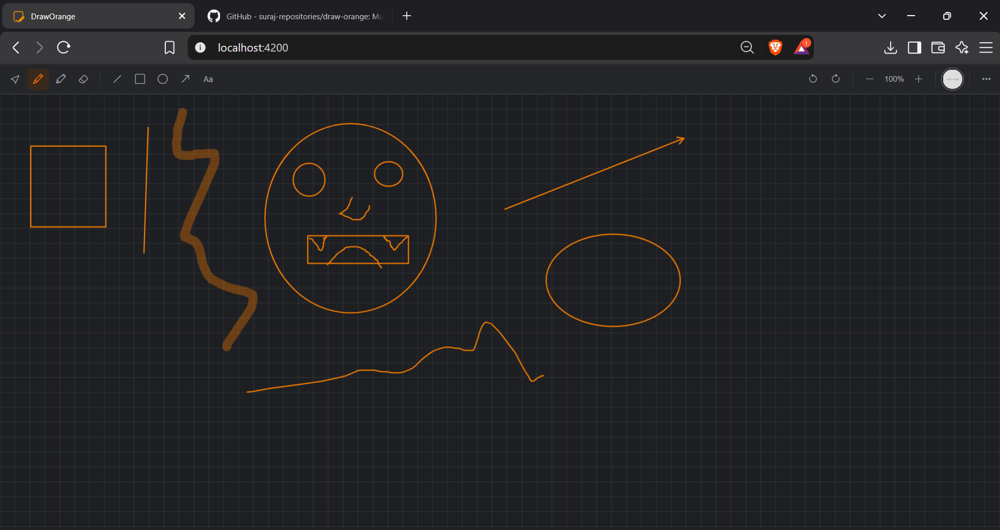

# Draw Orange (Multiuser Whiteboard) 
 
**🚧 Status: Under Development** 

A collaborative real-time whiteboard designed for **online meetings, classrooms, brainstorming, and team collaboration**.

## Features

* Real-time multiuser collaboration
* Drawing, shapes, text, and eraser tools
* Shared whiteboard sessions
* Clean and responsive UI
* Suitable for meetings and online classes
* Extensible architecture for future collaboration features

## Screenshots

<div style="display: flex; flex-direction: column; gap: 10px;">

  <div style="display: flex; gap: 10px;">
    
  </div>

</div>

## Tech Stack

* **Angular**
* **TypeScript**
* **HTML5 Canvas**
* **CSS3**

## Project Structure

```text
whiteboard/
├── canvas/       # Canvas rendering & interaction
├── toolbar/      # Whiteboard tools
├── models/       # Data models
└── services/     # Drawing & state management
```

## Getting Started

```bash
git clone <repository-url>
cd <project-directory>
npm install
ng serve
```

Open `http://localhost:4200` in your browser.

## Use Cases

* Online meetings
* Virtual classrooms
* Team brainstorming
* Project planning
* Diagramming and explanations

## Roadmap

* [ ] WebSocket-based real-time sync
* [ ] User presence & cursors
* [ ] Rooms and permissions
* [ ] Undo/redo synchronization
* [ ] Board persistence & export
* [ ] Sticky notes and advanced shapes

> **Goal:** Provide a simple shared visual workspace for people to **think, teach, plan, and collaborate together**.


 


